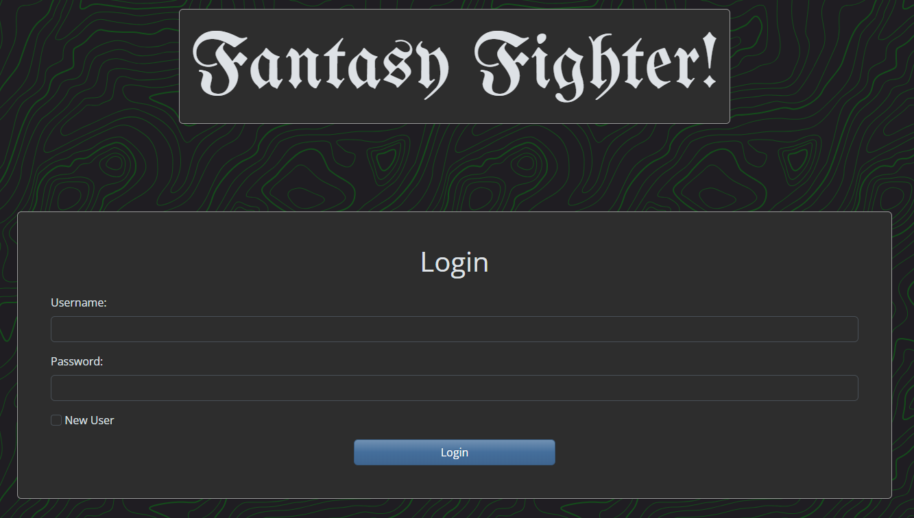
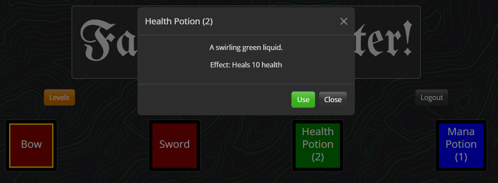
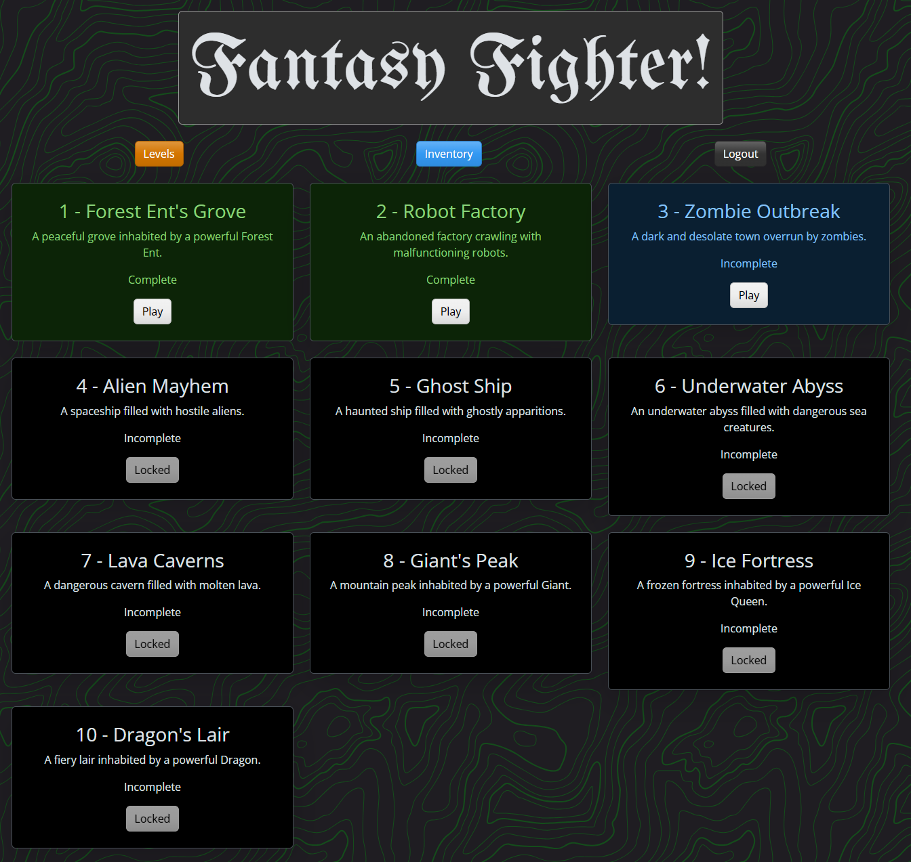

# Fantasy Fighter

## Overview & Technical Criteria

Fantasy Fighter is an immersive turn-based RPG that transports players into a chaotic world filled with aliens, zombies, and other fantastical creatures. As a brave protagonist, players engage in strategic combat, earn valuable loot, and customize their characters to grow stronger and progress through the game. Find the deployed app on [Render](https://project-2-c43n.onrender.com/)!

The game is built using the powerful PERN stack (PostgreSQL, Express, React, and Node.js), ensuring a seamless and robust gaming experience. The backend is powered by Node.js and Express.js, creating a RESTful API that efficiently handles both GET and POST requests for retrieving and adding new data. The database is managed using PostgreSQL and the Sequelize ORM, providing efficient data handling and manipulation. Fantasy Fighter includes authentication using JWT, ensuring secure user sessions and protecting API endpoints. Sensitive information, such as API keys, is safeguarded using environment variables, adding an extra layer of security.

On the front end, React is used to create a polished user interface that is both interactive and engaging. Players can easily navigate through the game, interact with various elements, and enjoy a smooth gaming experience. The game's UI is not only polished but also responsive, adapting to different screen sizes and devices. (Still best played on Desktop) The interactive elements respond to user input, providing an engaging and dynamic experience. Whether players are battling fierce enemies, managing their inventory, or exploring new levels, the game offers a captivating and enjoyable experience.

The project follows a well-organized folder structure that adheres to the separation of concerns design principle, promoting maintainability and scalability. The application is deployed on [Render](https://project-2-c43n.onrender.com/), making it accessible with live data and ensuring a reliable gaming experience. The application is hosted for free, and the database may spin down preventing access on the live site. You can clone or fork the repository and run it locally with npm run dev if the database in inaccessable. Fantasy Fighter meets high-quality coding standards, including proper file structure, naming conventions, indentation, and comprehensive comments. The game is a testament to the power of modern web technologies, delivering an exciting and immersive RPG experience that keeps players coming back for more.

If you find a bug, be sure to submit an issue!

## User Story

**As a player**,

**I want to** fight enemies in turn-based combat and earn loot,

**so that I can** grow stronger, customize my character, and progress through the game.

## Example Screenshots

1. **Home Page**

   

2. **Inventory Screen**

   

   **Inventory Modal**

   

3. **Levels Screen**

   

4. **Combat GUI**

    

## Authors

- [Kristenshields](https://github.com/Kristenshields)
- [Cinnlight](https://github.com/Cinnlight) (Hailey Smith)
- [MagicInUse](https://github.com/MagicInUse) (Jacob Norr)

## References

- [Dragon Icon Vectors by Vecteezy](https://www.vecteezy.com/free-vector/dragon-icon)
- [Bootswatch - Free Bootstrap Themes - Spacelab](https://bootswatch.com/spacelab)
- [Google Fonts](https://fonts.google.com/)
  - [UnifrakturMaguntia Font License](https://fonts.google.com/specimen/UnifrakturMaguntia/license)
- [Hero Patters SVG/CSS Topography](https://heropatterns.com/)
- [React-Bootstrap Docs](https://react-bootstrap.netlify.app/docs/)
- [AI Generated Sprites and Backgrounds ](https://openai.com/index/dall-e-3/)
- [Hand Drawn Assets](https://www.ashestoashlyn.com/)
