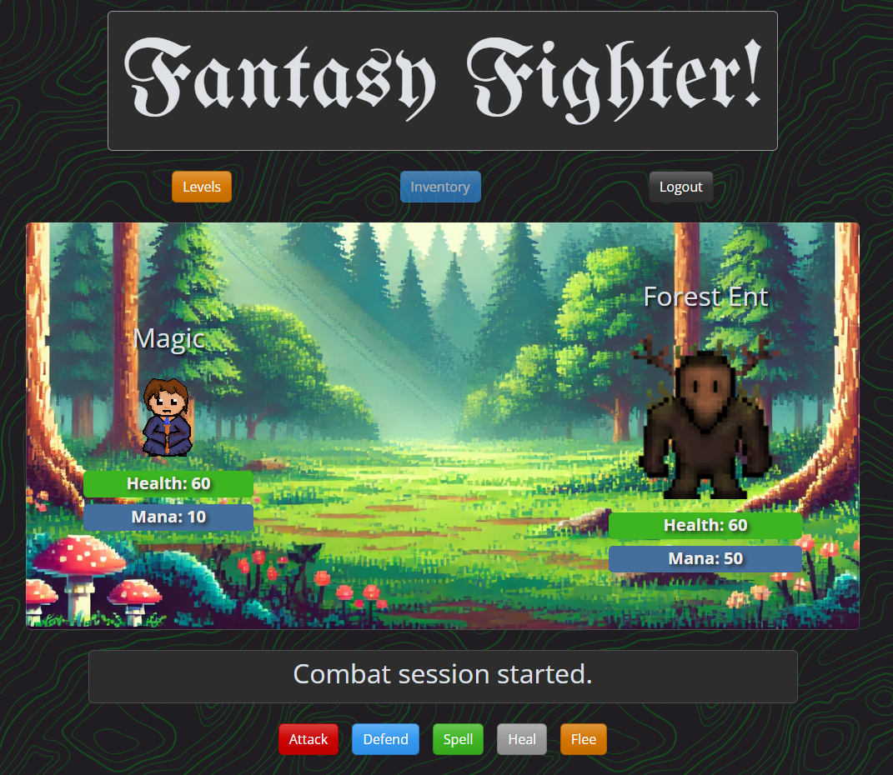

# Fantasy Fighter
A turn-based RPG featuring a Fantasy protagonist thrown into a world of chaos featuring aliens, zombies and much more! This full-stack application uses the ***PERN*** (PostgreSQL, Express, React, and Node.js) technology stack. The application also uses Typescript, Bootstrap, and JWTs (JSON Web Tokens) with local storage. Find the deployed app on [Render](https://project-2-c43n.onrender.com/)!

## User Story

**As a player**,

**I want to** fight enemies in turn-based combat and earn loot,

**so that I can** grow stronger, customize my character, and progress through the game.

## Example Screenshots

1. **Home Page**

   

2. **Inventory Screen**

   

   **Inventory Modal**

   

3. **Levels Screen**

   

4. **Combat GUI**

    

## Authors

- [Kristenshields](https://github.com/Kristenshields)
- [Cinnlight](https://github.com/Cinnlight) (Hailey Smith)
- [MagicInUse](https://github.com/MagicInUse) (Jacob Norr)

## References

- [Dragon Icon Vectors by Vecteezy](https://www.vecteezy.com/free-vector/dragon-icon)
- [Bootswatch - Free Bootstrap Themes - Spacelab](https://bootswatch.com/spacelab)
- [Google Fonts](https://fonts.google.com/)
  - [UnifrakturMaguntia Font License](https://fonts.google.com/specimen/UnifrakturMaguntia/license)
- [Hero Patters SVG/CSS Topography](https://heropatterns.com/)
- [React-Bootstrap Docs](https://react-bootstrap.netlify.app/docs/)
